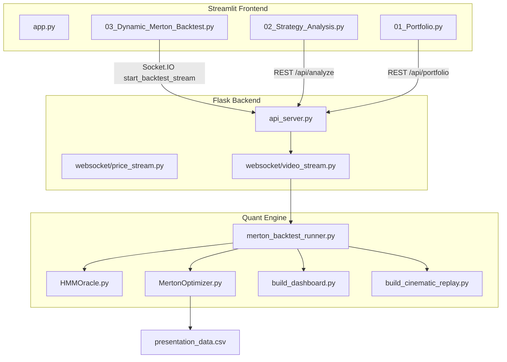

# Quantify — Regime-Adaptive Trading Platform

Multi-strategy analysis, paper trading, and HMM-driven Merton portfolio backtesting with live visualization.

---

## The Problem

Most systematic trading strategies are static they apply the same logic regardless of whether the market is trending, crashing, or grinding sideways. That creates predictable failure modes:

- A momentum strategy bleeds in sideways markets. A mean-reversion strategy gets steamrolled in a strong trend.
- Fixed allocations ignore the fact that asset correlations and volatility regimes change dramatically across market conditions.
- Naive regime-switching based on raw Hidden Markov Model outputs is noisy and leads to costly whipsawing between strategies.

Traditional approaches either ignore regime context entirely, or switch too aggressively on lagging signals without any statistical validation of whether a genuine distribution shift has occurred. Meanwhile, research prototypes often live as disconnected scripts with no way to explore results interactively, paper-trade ideas, or compare simpler baseline strategies side by side.

## Our Solution

**Quantify** is a full-stack quantitative trading platform that addresses both problems: statistically validated regime detection paired with regime-specific portfolio construction, wrapped in a Flask + Streamlit application for analysis, paper trading, and cinematic backtest replay.

- **3-state Gaussian HMM** on SPY with a Kolmogorov–Smirnov filter gating every proposed regime switch (`[backend/strategies/HMMOracle.py](backend/strategies/HMMOracle.py)`)
- **DynamicRegimeMerton** Backtrader strategy with gatekeeper filters and Merton mean-variance allocation (`[backend/strategies/MertonOptimizer.py](backend/strategies/MertonOptimizer.py)`)
- **Flask REST + Socket.IO** API for strategy analysis, paper trading, live prices, and backtest streaming (`[backend/api_server.py](backend/api_server.py)`)
- **Streamlit multi-page UI** for portfolio management, SMA/RSI analysis, and the Dynamic Merton backtest (`[frontend/app.py](frontend/app.py)`)
- **Paper trading** with JSON-backed persistence (`[backend/execution/paper_broker.py](backend/execution/paper_broker.py)`)
- **Cinematic replay + Plotly dashboard** generated from daily backtest snapshots (`[backend/strategies/build_cinematic_replay.py](backend/strategies/build_cinematic_replay.py)`, `[backend/strategies/build_dashboard.py](backend/strategies/build_dashboard.py)`)

**Regime routing:**


| Regime   | ID  | Universe                   | Logic                                       |
| -------- | --- | -------------------------- | ------------------------------------------- |
| Bear     | 0   | `BIL`                      | 100% cash equivalent — capital preservation |
| Kangaroo | 1   | `GLD`, `TLT`, `DBC`, `XLU` | Defensive / inflation hedges                |
| Bull     | 2   | `SPY`, `QQQ`, `IWM`, `XLK` | Risk-on momentum                            |


For a step-by-step walkthrough of every file and data flow, see [WORKFLOW.md](WORKFLOW.md).

---

## Architecture




| Component               | File                                                                                           | Role                                                                                         |
| ----------------------- | ---------------------------------------------------------------------------------------------- | -------------------------------------------------------------------------------------------- |
| Regime Detection Engine | `[backend/strategies/HMMOracle.py](backend/strategies/HMMOracle.py)`                           | Walk-forward Gaussian HMM + K-S filter on SPY; also contains legacy `RegimeAdaptiveStrategy` |
| Backtrader Strategy     | `[backend/strategies/MertonOptimizer.py](backend/strategies/MertonOptimizer.py)`               | `DynamicRegimeMerton` — gatekeepers, Merton allocation, daily CSV logging                    |
| Backtest Orchestrator   | `[backend/strategies/merton_backtest_runner.py](backend/strategies/merton_backtest_runner.py)` | Wires HMM → Cerebro → replay → dashboard → WebSocket results                                 |
| Daily Snapshot Export   | `[backend/presentation_data.csv](backend/presentation_data.csv)`                               | Auto-generated end-of-day portfolio log for visualization                                    |
| API Server              | `[backend/api_server.py](backend/api_server.py)`                                               | REST endpoints, Socket.IO handlers, paper broker                                             |
| Frontend                | `[frontend/](frontend/)`                                                                       | Streamlit pages for portfolio, analysis, and backtest UI                                     |


---

## How It Works

### Regime Detection (`HMMOracle.py`)

The system classifies every trading day into one of three regimes using a Gaussian HMM trained on four engineered features derived from SPY:


| Feature     | Description                                  |
| ----------- | -------------------------------------------- |
| Log Returns | Daily log return                             |
| Volatility  | 20-day rolling standard deviation of returns |
| RSI         | 14-period Relative Strength Index            |
| Trend       | 50-day rolling mean of returns               |


Regimes are ordered by the mean return of each HMM state after training:


| ID  | Regime   | Description                      |
| --- | -------- | -------------------------------- |
| 0   | Bear     | Negative trend, high volatility  |
| 1   | Kangaroo | Sideways, mean-reverting         |
| 2   | Bull     | Positive trend, lower volatility |


**Walk-forward training:** The model retrains every 40 days on all available history up to that point (no future data), after an initial 252-day warmup period.

**K-S filter:** A regime switch is only accepted when all four conditions are simultaneously met:

1. Held current regime for ≥ 20 days
2. K-S test p-value < 0.20 (recent returns statistically differ from regime history)
3. HMM confidence > 0.55
4. HMM suggests a different regime than the active one

### Strategy Execution (`MertonOptimizer.py`)

Each regime activates a different asset universe and allocation logic inside the `DynamicRegimeMerton` Backtrader strategy.

**The Gatekeeper (eligibility filter)**

Before any allocation, each asset must pass regime-specific filters:

- **Volatility check (universal):** If already invested, current vol must be below the 90th percentile of its 252-day history. If not invested, must be below the 80th percentile.
- **Bull / Bear (trend):** ADX > 25 to enter, ADX > 15 to hold.
- **Kangaroo (mean reversion):** RSI between 45–55 to enter, 35–65 to hold.

**Merton portfolio allocation**

Weights are calculated using a continuous-time Merton framework with shrinkage:

```
w* = Σ⁻¹(μ − rf) / γ
```

- **μ** — EWMA expected returns (α = 0.05), annualized, with a 1.2× boost in Bull regime
- **Σ** — Ledoit-Wolf-style shrinkage covariance (90% sample + 10% diagonal target)
- **γ** — Risk aversion = `base_gamma × regime_multiplier` (Bull = 0.5×, Kangaroo = 1.5×, Bear = 3.0×)
- Weights clipped to [0, `max_weight`], then scaled to full leverage (long-only)
- **Rebalancing:** Trades execute only when weight deviation exceeds a 5% threshold

### Platform Workflows

1. **Dynamic Merton Backtest** — User selects dates in Streamlit → WebSocket triggers threaded backtest → cinematic frame stream → Plotly dashboard embedded in results → metrics polled via REST
2. **Strategy Analysis** — SMA or RSI analysis on any symbol via REST, with Plotly candlestick charts and performance metrics
3. **Paper Portfolio** — Manual buy/sell with live prices, persisted to `paper_portfolio.json`
4. **CLI event loop** — Optional dev path: live price polling → SMA signals → paper broker (`backend/main.py`)

---

## Configuration

### Regime Detection (`HMMOracle.py`)

```python
N_REGIMES = 3
INITIAL_TRAINING_DAYS = 252
RETRAIN_FREQUENCY = 40
KS_WINDOW = 40
KS_PVALUE_THRESHOLD = 0.20
HMM_CONFIDENCE_THRESHOLD = 0.55
MIN_HOLDING_DAYS = 20
```

### Strategy & Backtest (`MertonOptimizer.py`, `merton_backtest_runner.py`)

```python
# Strategy parameters
lookback = 63
base_gamma = 2.5
max_weight = 0.4
max_leverage = 1.0
rebalance_threshold = 0.05
risk_free_rate = 0.02

# Backtest settings
ALL_TICKERS = ["SPY", "QQQ", "IWM", "XLK", "GLD", "TLT", "DBC", "XLU", "BIL"]
INITIAL_CASH = 100_000
commission = 0.00005    # ~0.005% (modern ETF pricing)
slippage = 0.0002       # 0.02% bid-ask slippage
```

**Default UI date range:** 2015-01-01 to 2025-01-01. The HMM requires a 252-day warmup before emitting regime signals; the strategy also uses a 252-day SMA warmup indicator on SPY to keep Backtrader in its pre-next phase during the initial history build.

---

## Installation

**Prerequisites:** Python 3.7+, internet connection (yfinance data), web browser.

The backend imports modules as `project.backend.*`. The repository folder must be named `project`, or you must add its parent directory to `PYTHONPATH`.

```bash
# Backend dependencies
cd backend
pip install -r requirements.txt

# Frontend dependencies
cd ../frontend
pip install -r requirements.txt
```

**Backend packages** include Flask, Flask-CORS, Flask-SocketIO, backtrader, hmmlearn, scipy, scikit-learn, plotly, yfinance, pandas, numpy, and matplotlib.

**Frontend packages** include Streamlit, Plotly, requests, yfinance, pandas, and numpy.

---

## Usage

### Full platform (recommended)

```bash
# Terminal 1 — start API server (from backend/)
cd backend
python api_server.py

# Terminal 2 — start Streamlit UI (from frontend/)
cd frontend
streamlit run app.py
```

Open the sidebar to navigate between **Portfolio**, **Strategy Analysis**, and **Dynamic Merton Backtest**.

### Standalone quant scripts

Run from the `backend/` directory. These write `presentation_data.csv` to the current working directory.

```bash
cd backend

# Primary Dynamic Regime Merton backtest
python strategies/MertonOptimizer.py

# Legacy RegimeAdaptiveStrategy backtest (simpler allocation logic)
python strategies/HMMOracle.py
```

### CLI event-loop demo

```bash
cd backend
python main.py
```

Polls live AAPL prices, runs an SMA crossover strategy, and executes signals through the paper broker.

---

## Output

### Console (backtest)

When a backtest completes, Backtrader analyzers report:

```
Starting Portfolio Value: $100,000.00
Ending Portfolio Value:   $XXX,XXX.XX

Annualized Sharpe Ratio: X.XXX
Max Drawdown: XX.XX%
Total Return: XXX.XX%
CAGR: XX.XX%

YEARLY RETURNS
  2015: X.XX%
  ...
```

### CSV Export (`presentation_data.csv`)

Written to `backend/presentation_data.csv` when the API server runs the backtest (relative to the server's working directory).


| Column            | Description                          |
| ----------------- | ------------------------------------ |
| `Date`            | Trading date                         |
| `Portfolio_Value` | End-of-day portfolio value           |
| `Regime`          | Active regime (0, 1, or 2)           |
| `Holdings`        | Dictionary string of ticker → weight |


### WebSocket & REST results

During a UI backtest, the server emits:

- `backtest_frame` — base64-encoded PNG frames for the cinematic replay
- `stream_complete` — signals replay finished
- `backtest_results` — final payload with Sharpe, drawdown, CAGR, annual returns, trade stats, embedded Plotly `dashboard_html`, and `final_frame_b64`

Poll results via `GET /get_results/<client_id>` or `GET /get_results/latest`.

---

## File Structure

```
project/
├── README.md                              # This file
├── WORKFLOW.md                            # Detailed per-file workflow reference
├── .gitignore
│
├── backend/
│   ├── __init__.py                        # Backend package marker
│   ├── api_server.py                      # Flask app, REST + Socket.IO
│   ├── main.py                            # CLI event-loop entry point
│   ├── requirements.txt
│   ├── presentation_data.csv              # Auto-generated backtest daily log
│   ├── paper_portfolio.json               # Paper trading state
│   │
│   ├── core/
│   │   ├── event.py                       # MarketEvent, Signal, SignalType
│   │   ├── dispatcher.py                  # Event dispatch to handlers
│   │   └── normalizer.py                  # Raw event → MarketEvent
│   │
│   ├── data/
│   │   ├── data_source.py                 # MockMarketDataSource (random walk)
│   │   ├── live_data_polling.py           # LiveMarketDataSource polling loop
│   │   └── live_api_service.py            # LiveAPIService, EnhancedLiveMarketDataSource
│   │
│   ├── execution/
│   │   └── paper_broker.py                # JSON-backed paper trading broker
│   │
│   ├── strategies/
│   │   ├── HMMOracle.py                   # HMM + K-S regime detection
│   │   ├── MertonOptimizer.py             # DynamicRegimeMerton strategy
│   │   ├── merton_backtest_runner.py      # UI backtest orchestrator
│   │   ├── build_dashboard.py             # Plotly interactive dashboard
│   │   ├── build_cinematic_replay.py      # Matplotlib frame stream / GIF
│   │   ├── sma_manual.py                  # SMA crossover (API / CLI)
│   │   ├── rsi_manual.py                  # RSI momentum (API)
│   │   ├── sma_strategy.py                # SMA for event-loop path
│   │   └── pairs_trading_manual.py        # Pairs trading (CLI, unused in UI)
│   │
│   └── websocket/
│       ├── price_stream.py                # Live price WebSocket streaming
│       └── video_stream.py                # Backtest thread launcher
│
└── frontend/
    ├── README.md                          # Frontend-specific quick start
    ├── app.py                             # Home page + TradingAnalyzer class
    ├── requirements.txt
    ├── pages/
    │   ├── 01_Portfolio.py                # Paper trading portfolio page
    │   ├── 02_Strategy_Analysis.py        # SMA / RSI analysis page
    │   └── 03_Dynamic_Merton_Backtest.py # Regime Merton backtest page
    └── components/
        ├── live_price_widget.py           # Live price Socket.IO widget
        └── paper_portfolio_widget.py      # Portfolio management widget
```

---

## Design Decisions

**Why a K-S filter instead of direct HMM state switching?**
Raw HMM state sequences are noisy. The Kolmogorov–Smirnov test adds a statistical requirement that the return distribution has genuinely shifted before a regime switch is accepted, significantly reducing whipsawing. See `get_regime_signals_with_ks_filter()` in `[HMMOracle.py](backend/strategies/HMMOracle.py)`.

**Why BIL only in Bear regime?**
Shorting based on a lagging regime signal introduces negative convexity. Pure cash preservation via `BIL` avoids being caught short during rapid recoveries. This change is documented in the changelog comments at the top of `[MertonOptimizer.py](backend/strategies/MertonOptimizer.py)`.

**Why Merton instead of minimum variance?**
Minimum-variance allocation ignores expected returns and tends to over-concentrate in low-volatility assets. The Merton framework incorporates momentum signals via EWMA returns while still penalizing variance through the risk aversion parameter γ.

**Why Flask + Streamlit instead of a monolith?**
Separating the API from the UI allows REST reuse for strategy analysis and paper trading, while Socket.IO handles the frame-by-frame backtest replay that would be awkward in pure Streamlit. The backtest runs in a background thread so the server stays responsive.

**Why two backtest strategies coexist?**
`RegimeAdaptiveStrategy` in `[HMMOracle.py](backend/strategies/HMMOracle.py)` is an earlier, simpler approach (Bull = SPY momentum, Kangaroo = min-variance). `DynamicRegimeMerton` in `[MertonOptimizer.py](backend/strategies/MertonOptimizer.py)` is the production path wired to the Streamlit UI with gatekeepers and Merton allocation.

**Why JSON file storage instead of a database?**
Paper trading and backtest snapshots are lightweight, single-user artifacts. JSON and CSV keep the setup zero-config for local development.

---

## Caveats

- Past performance does not guarantee future results.
- HMM regime detection is inherently backward-looking and will lag at turning points.
- The system is designed for liquid US ETFs; applying it to illiquid instruments will amplify slippage costs.
- Transaction costs are modeled but may underestimate real-world impact for large position sizes.
- All market data comes from yfinance; availability and accuracy depend on Yahoo Finance.
- `run_merton_backtest()` in `[merton_backtest_runner.py](backend/strategies/merton_backtest_runner.py)` is a stub; the UI uses `run_merton_backtest_and_stream()`.
- Module imports assume the parent directory is named `project` and on `sys.path`.
- No `.env` or secrets management — intended for local development only.
- `POST /api/backtest/dynamic_merton` is deprecated and returns 404; use the WebSocket backtest path instead.

