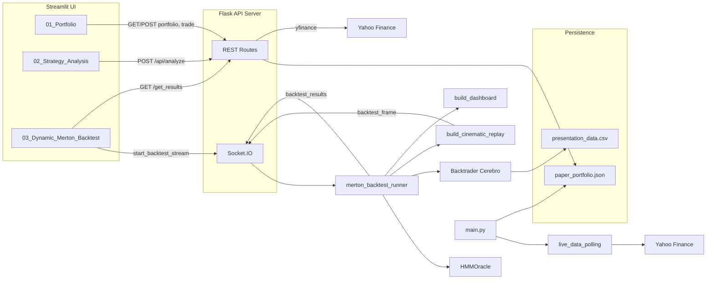
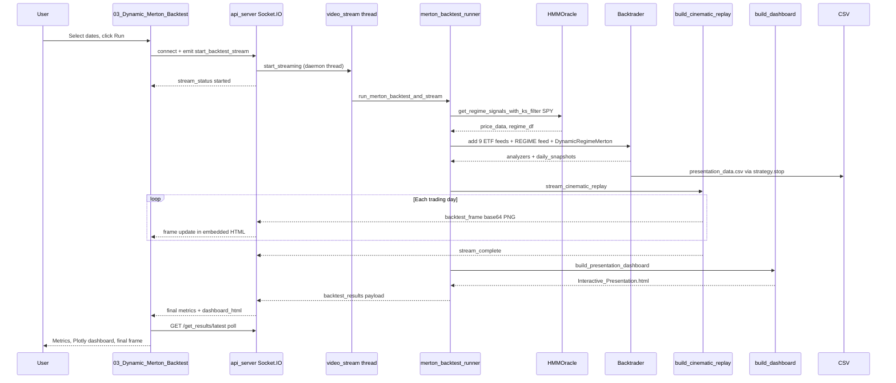

# Quantify — Workflow & File Reference

This document describes the end-to-end workflows of the Quantify platform and the role of every file in the repository. For a high-level overview, see [README.md](README.md).

---

## System Overview

Quantify has four independent execution paths that share the Flask API server but operate on different data:



---

## Subsystem A: Dynamic Merton Backtest (Primary Quant Path)

This is the flagship workflow: HMM regime detection on SPY, multi-ETF Merton allocation in Backtrader, cinematic WebSocket replay, and an interactive Plotly dashboard.

### Step-by-step flow



### Detailed steps

1. **User input** — [`frontend/pages/03_Dynamic_Merton_Backtest.py`](frontend/pages/03_Dynamic_Merton_Backtest.py)
   - User selects start/end dates (defaults: 2015-01-01 to 2025-01-01).
   - Clicking "Run Dynamic Merton Backtest" transitions to the `streaming` phase.
   - An embedded HTML component opens a Socket.IO connection to `http://127.0.0.1:5000`.

2. **WebSocket trigger** — [`backend/api_server.py`](backend/api_server.py) (`start_backtest_stream` handler)
   - Clears `results_store`.
   - Calls `backtest_stream.start_streaming(start_date, end_date, client_id, results_store)`.
   - Emits `stream_status` with `started`.

3. **Background thread** — [`backend/websocket/video_stream.py`](backend/websocket/video_stream.py)
   - `LiveBacktestStream.start_streaming()` spawns a daemon thread.
   - Thread calls `run_merton_backtest_and_stream()` from [`merton_backtest_runner.py`](backend/strategies/merton_backtest_runner.py).
   - On exception, emits `stream_error` to the client room.

4. **Regime detection** — [`backend/strategies/HMMOracle.py`](backend/strategies/HMMOracle.py)
   - `get_regime_signals_with_ks_filter("SPY", start_date, end_date)` downloads SPY via yfinance.
   - Engineers four features: log returns, 20-day vol, RSI(14), 50-day trend.
   - Walk-forward trains a 3-state Gaussian HMM every 40 days (after 252-day warmup).
   - K-S filter gates regime switches (min hold 20 days, p < 0.20, confidence > 0.55).
   - Returns `(price_data, results_df)` with columns including `regime`, `bear_prob`, `kangaroo_prob`, `bull_prob`, `ks_pvalue`, `switch_signal`.

5. **Backtrader execution** — [`backend/strategies/merton_backtest_runner.py`](backend/strategies/merton_backtest_runner.py)
   - Downloads all 9 ETFs: `SPY`, `QQQ`, `IWM`, `XLK`, `GLD`, `TLT`, `DBC`, `XLU`, `BIL`.
   - Adds `PandasRegimeData` feed named `REGIME` with the HMM regime column.
   - Configures broker: $100,000 cash, commission 0.00005, slippage 0.0002.
   - Runs `DynamicRegimeMerton` from [`MertonOptimizer.py`](backend/strategies/MertonOptimizer.py).
   - Attaches analyzers: SharpeRatio, AnnualReturn, TradeAnalyzer, Returns, DrawDown.

6. **Daily strategy loop** — [`DynamicRegimeMerton.next()`](backend/strategies/MertonOptimizer.py)
   - Reads current regime from the REGIME data feed.
   - Updates a 63-day returns buffer per asset.
   - Runs gatekeeper (`get_eligible_assets`) — vol percentiles, ADX or RSI checks.
   - Computes Merton weights (`calculate_merton_weights`) — EWMA μ, shrinkage Σ, regime-scaled γ.
   - Rebalances when weight drift exceeds 5%.
   - Appends daily snapshot: Date, Portfolio_Value, Regime, Holdings.

7. **CSV export** — [`DynamicRegimeMerton.stop()`](backend/strategies/MertonOptimizer.py)
   - Liquidates all open positions (so TradeAnalyzer captures final PnL).
   - Writes `presentation_data.csv` to the **current working directory** (typically `backend/`).

8. **Cinematic replay** — [`backend/strategies/build_cinematic_replay.py`](backend/strategies/build_cinematic_replay.py)
   - `stream_cinematic_replay()` reads the CSV.
   - Renders matplotlib frames day-by-day with regime-colored backgrounds.
   - Emits each frame as `backtest_frame` with base64 PNG and progress percentage.
   - Emits `stream_complete` when finished.
   - Optionally returns the final frame as `final_frame_b64`.

9. **Plotly dashboard** — [`backend/strategies/build_dashboard.py`](backend/strategies/build_dashboard.py)
   - `build_presentation_dashboard()` reads the CSV.
   - Builds an interactive equity curve with regime background bands and holdings hover tooltips.
   - Writes `Interactive_Presentation.html` (ephemeral — read into memory and deleted).

10. **Results delivery** — [`merton_backtest_runner.py`](backend/strategies/merton_backtest_runner.py)
    - Assembles `final_results` dict: Sharpe, drawdown, CAGR, annual returns, trade stats, `dashboard_html`, `final_frame_b64`.
    - Emits `backtest_results` via Socket.IO to the client room.
    - Stores in `results_store['latest']` and `results_store[client_id]`.

11. **UI results phase** — [`03_Dynamic_Merton_Backtest.py`](frontend/pages/03_Dynamic_Merton_Backtest.py)
    - Polls `GET /get_results/latest` until `ready: true`.
    - Displays metrics, embedded Plotly dashboard, and final replay frame.

---

## Subsystem B: Strategy Analysis

Lightweight SMA and RSI analysis on any stock symbol without Backtrader.

### Flow

```
02_Strategy_Analysis.py
  → TradingAnalyzer.analyze_symbol()  (frontend/app.py)
    → POST /api/analyze               (backend/api_server.py)
      → StrategyAPI.analyze_symbol()
        → yfinance Ticker.history()
        → SMAStrategy.on_price() or RSIMomentumStrategy.on_price()
          (sma_manual.py / rsi_manual.py)
      ← JSON: OHLCV, indicators, signals, trading_performance
  → Plotly candlestick + indicator charts
  → Performance dashboard (Sharpe, win rate, drawdown, trade history)
```

### Key behaviors

- **SMA:** Buy when fast SMA crosses above slow SMA; sell on cross below. Default fast=10, slow=20.
- **RSI:** Buy when RSI > lower threshold with positive momentum; sell when RSI > upper threshold or momentum turns negative. Default period=14, lower=30, upper=70.
- Period options: 1mo, 3mo, 6mo, 1y, 2y.
- Live signal available via `POST /api/live-signal` using the same strategy classes.

---

## Subsystem C: Paper Trading

Virtual portfolio with $100,000 starting balance, persisted to JSON.

### Flow

```
01_Portfolio.py
  → paper_portfolio_widget.create_portfolio_section()
    → GET  /api/portfolio          → PaperBroker.get_portfolio_summary()
    → POST /api/trade              → LiveAPIService.get_live_price() → PaperBroker.execute()
    → POST /api/portfolio/reset    → PaperBroker.reset_portfolio()
  ↔ paper_portfolio.json
```

### PaperBroker details — [`backend/execution/paper_broker.py`](backend/execution/paper_broker.py)

- Initial balance: $100,000.
- Tracks cash, positions (symbol → shares), and transaction history.
- BUY deducts cash; SELL adds cash. Validates sufficient cash/shares.
- Saves state to `paper_portfolio.json` after every trade.
- **Not connected** to the HMM/Merton backtest — independent demo path.

---

## Subsystem D: Live Price Streaming

Real-time price updates via WebSocket for subscribed symbols.

### Flow

```
live_price_widget.py (frontend component)
  → Socket.IO subscribe_price { symbol }
    → api_server.py join_room + price_stream.start_streaming()
      → price_stream.py polls LiveAPIService every few seconds
        → live_api_service.py fetches 1-minute bars via yfinance
      ← emit price_update to symbol room
  → Widget updates displayed price

unsubscribe_price → leave_room + stop_streaming
```

REST alternative: `GET /api/live-price/<symbol>` returns a one-shot price snapshot.

---

## Subsystem E: CLI Event Loop

Development/demo path that bypasses the web UI entirely.

### Flow

```
main.py
  → LiveMarketDataSource("AAPL", poll_interval=5)    (live_data_polling.py)
  → SimpleMarketNormalizer.normalize()                 (normalizer.py)
  → EventDispatcher.dispatch()                         (dispatcher.py)
    → SMAStrategy.on_price()                           (sma_manual.py)
    → PaperBroker.execute()                            (paper_broker.py)
  ↔ paper_portfolio.json
```

Alternative strategies can be swapped in `main.py`: `RSIMomentumStrategy`, `PairsTradingStrategy`. `MockMarketDataSource` provides a random-walk feed for offline testing.

---

## Complete File Reference

### Root

| File | Role |
|------|------|
| [`README.md`](README.md) | Project overview, installation, configuration, design decisions |
| [`WORKFLOW.md`](WORKFLOW.md) | This file — detailed workflows and per-file reference |
| [`.gitignore`](.gitignore) | Ignores `__pycache__/` and `venv/` |

### Backend — Core

| File | Role |
|------|------|
| [`backend/__init__.py`](backend/__init__.py) | Package marker; documents backend as "Quantitative Trading Platform" |
| [`backend/api_server.py`](backend/api_server.py) | Flask application: REST routes, Socket.IO handlers, `StrategyAPI`, `PaperBroker` instance, `results_store` |
| [`backend/main.py`](backend/main.py) | CLI entry point: live polling → normalize → dispatch → SMA → paper broker loop |
| [`backend/requirements.txt`](backend/requirements.txt) | Python dependencies for the backend |
| [`backend/presentation_data.csv`](backend/presentation_data.csv) | Auto-generated daily backtest log (Date, Portfolio_Value, Regime, Holdings) |
| [`backend/paper_portfolio.json`](backend/paper_portfolio.json) | Paper trading state: cash, positions, transactions |

### Backend — Core (`core/`)

| File | Role |
|------|------|
| [`backend/core/event.py`](backend/core/event.py) | `MarketEvent`, `Signal`, `SignalType` (BUY/SELL/HOLD) dataclasses |
| [`backend/core/dispatcher.py`](backend/core/dispatcher.py) | `EventDispatcher` — calls registered handler for each normalized event |
| [`backend/core/normalizer.py`](backend/core/normalizer.py) | `SimpleMarketNormalizer` — validates and converts raw events to `MarketEvent` |

### Backend — Data (`data/`)

| File | Role |
|------|------|
| [`backend/data/data_source.py`](backend/data/data_source.py) | `MockMarketDataSource` — synthetic random-walk price generator |
| [`backend/data/live_data_polling.py`](backend/data/live_data_polling.py) | `LiveMarketDataSource` — polls yfinance on an interval, yields raw events |
| [`backend/data/live_api_service.py`](backend/data/live_api_service.py) | `LiveAPIService` (1m bar price lookup), `EnhancedLiveMarketDataSource` |

### Backend — Execution (`execution/`)

| File | Role |
|------|------|
| [`backend/execution/paper_broker.py`](backend/execution/paper_broker.py) | `PaperBroker` — virtual cash/positions, trade execution, JSON persistence |

### Backend — Strategies (`strategies/`)

| File | Role |
|------|------|
| [`backend/strategies/HMMOracle.py`](backend/strategies/HMMOracle.py) | `get_regime_signals_with_ks_filter()` — walk-forward HMM + K-S filter; legacy `RegimeAdaptiveStrategy` + `run_regime_adaptive_backtest()` |
| [`backend/strategies/MertonOptimizer.py`](backend/strategies/MertonOptimizer.py) | `DynamicRegimeMerton` strategy, `PandasRegimeData` feed, `LogReturns` indicator; standalone `__main__` backtest |
| [`backend/strategies/merton_backtest_runner.py`](backend/strategies/merton_backtest_runner.py) | `run_merton_backtest_and_stream()` — orchestrates HMM → Cerebro → replay → dashboard → WebSocket results; `run_merton_backtest()` is a stub |
| [`backend/strategies/build_dashboard.py`](backend/strategies/build_dashboard.py) | `build_presentation_dashboard()` — Plotly equity curve with regime bands and holdings tooltips |
| [`backend/strategies/build_cinematic_replay.py`](backend/strategies/build_cinematic_replay.py) | `stream_cinematic_replay()` — matplotlib frame-by-frame WebSocket stream; `build_cinematic_replay()` for GIF fallback |
| [`backend/strategies/sma_manual.py`](backend/strategies/sma_manual.py) | `SMAStrategy` — fast/slow crossover signals for API and CLI |
| [`backend/strategies/rsi_manual.py`](backend/strategies/rsi_manual.py) | `RSIMomentumStrategy` — RSI threshold signals for API |
| [`backend/strategies/sma_strategy.py`](backend/strategies/sma_strategy.py) | Alternate SMA implementation for the event-loop path |
| [`backend/strategies/pairs_trading_manual.py`](backend/strategies/pairs_trading_manual.py) | `PairsTradingStrategy` — pairs spread trading (CLI only, not exposed in UI) |

### Backend — WebSocket (`websocket/`)

| File | Role |
|------|------|
| [`backend/websocket/price_stream.py`](backend/websocket/price_stream.py) | `LivePriceStream` — manages per-symbol polling threads, emits `price_update` |
| [`backend/websocket/video_stream.py`](backend/websocket/video_stream.py) | `LiveBacktestStream` — spawns daemon thread for `run_merton_backtest_and_stream()` |

### Frontend

| File | Role |
|------|------|
| [`frontend/README.md`](frontend/README.md) | Frontend-specific quick start (SMA/RSI focus) |
| [`frontend/app.py`](frontend/app.py) | Home page, `TradingAnalyzer` class (API client, chart builders, performance display) |
| [`frontend/requirements.txt`](frontend/requirements.txt) | Python dependencies for the Streamlit frontend |
| [`frontend/pages/01_Portfolio.py`](frontend/pages/01_Portfolio.py) | Paper trading portfolio page |
| [`frontend/pages/02_Strategy_Analysis.py`](frontend/pages/02_Strategy_Analysis.py) | SMA/RSI strategy analysis with charts and live signals |
| [`frontend/pages/03_Dynamic_Merton_Backtest.py`](frontend/pages/03_Dynamic_Merton_Backtest.py) | Dynamic Merton backtest with Socket.IO replay and results dashboard |
| [`frontend/components/live_price_widget.py`](frontend/components/live_price_widget.py) | Reusable live price display with Socket.IO subscription |
| [`frontend/components/paper_portfolio_widget.py`](frontend/components/paper_portfolio_widget.py) | Portfolio summary, trade form, transaction history |

---

## API Reference

### REST Endpoints

| Method | Path | Description |
|--------|------|-------------|
| `GET` | `/api/strategies` | List available strategies (SMA, RSI) with parameter info |
| `POST` | `/api/analyze` | Run historical strategy analysis on a symbol. Body: `{ symbol, strategy, params, period }` |
| `POST` | `/api/live-signal` | Get current signal for a symbol. Body: `{ symbol, strategy, params }` |
| `GET` | `/api/health` | Health check |
| `GET` | `/api/live-price/<symbol>` | One-shot live price for a symbol |
| `GET` | `/api/streaming/status` | Status of active price streams |
| `GET` | `/api/portfolio` | Paper portfolio summary (cash, positions, PnL) |
| `POST` | `/api/portfolio/reset` | Reset paper portfolio to $100,000 |
| `POST` | `/api/trade` | Execute paper trade. Body: `{ symbol, action, quantity }` |
| `GET` | `/get_results/<client_id>` | Poll backtest results. Use `latest` as client_id for most recent |
| `POST` | `/clear_results` | Clear the in-memory results store |
| `POST` | `/api/backtest/dynamic_merton` | **Deprecated** — returns 404 |

### Socket.IO Events

| Event | Direction | Payload | Description |
|-------|-----------|---------|-------------|
| `connect` | Server → Client | `{ status: connected }` | Client connected |
| `connection_status` | Server → Client | `{ status }` | Connection acknowledgment |
| `start_backtest_stream` | Client → Server | `{ start_date, end_date }` | Triggers backtest in background thread |
| `stream_status` | Server → Client | `{ status, message }` | Backtest stream initiated |
| `backtest_frame` | Server → Client | `{ frame_b64, progress, date, portfolio_value, regime }` | Single replay frame |
| `stream_complete` | Server → Client | `{ message }` | Cinematic replay finished |
| `backtest_results` | Server → Client | See below | Final metrics and dashboard |
| `stream_error` | Server → Client | `{ error }` | Backtest thread exception |
| `subscribe_price` | Client → Server | `{ symbol }` | Start live price stream for symbol |
| `unsubscribe_price` | Client → Server | `{ symbol }` | Stop live price stream |
| `subscription_status` | Server → Client | `{ symbol, status, message }` | Subscription acknowledgment |
| `price_update` | Server → Client | `{ symbol, price, timestamp }` | Live price tick |

### `backtest_results` payload fields

| Field | Type | Description |
|-------|------|-------------|
| `start_date` | string | Backtest start date |
| `end_date` | string | Backtest end date |
| `initial_cash` | number | Starting capital (100000) |
| `final_portfolio_value` | number | Ending portfolio value |
| `annualized_sharpe_ratio` | number | Sharpe ratio (daily, annualized) |
| `max_drawdown_percent` | number | Maximum drawdown percentage |
| `total_return_log_percent` | number | Total log return × 100 |
| `cagr_percent` | number | Compound annual growth rate |
| `annual_returns_df` | JSON string | Year-by-year returns (pandas split orient) |
| `trade_analysis` | object | Total/winning/losing trades, net PnL |
| `dashboard_html` | string | Full Plotly HTML dashboard (embedded in UI) |
| `final_frame_b64` | string | Base64 PNG of the final cinematic replay frame |

---

## Data Artifacts

### `presentation_data.csv`

| Property | Detail |
|----------|--------|
| **Produced by** | `DynamicRegimeMerton.stop()` in [`MertonOptimizer.py`](backend/strategies/MertonOptimizer.py) |
| **Consumed by** | [`build_dashboard.py`](backend/strategies/build_dashboard.py), [`build_cinematic_replay.py`](backend/strategies/build_cinematic_replay.py) |
| **Location** | Written relative to the process working directory (typically `backend/presentation_data.csv` when running `api_server.py`) |
| **Columns** | `Date`, `Portfolio_Value`, `Regime` (0/1/2), `Holdings` (Python dict string, e.g. `{'SPY': 0.35, 'QQQ': 0.25}`) |
| **Lifecycle** | Overwritten on each backtest run |

### `paper_portfolio.json`

| Property | Detail |
|----------|--------|
| **Produced by** | `PaperBroker.save_portfolio()` after every trade or reset |
| **Consumed by** | `PaperBroker.load_portfolio()` on startup |
| **Location** | `backend/paper_portfolio.json` (relative to working directory) |
| **Fields** | `cash_balance`, `positions`, `transactions`, `total_invested`, `last_updated` |
| **Lifecycle** | Persists across server restarts until reset |

### `Interactive_Presentation.html`

| Property | Detail |
|----------|--------|
| **Produced by** | `build_presentation_dashboard()` |
| **Consumed by** | Read into `dashboard_html` in the WebSocket payload, then **deleted** |
| **Lifecycle** | Ephemeral — exists only during result assembly |

---

## Running Order & Working Directories

### Recommended startup sequence

```bash
# 1. Install dependencies (once)
cd backend && pip install -r requirements.txt
cd ../frontend && pip install -r requirements.txt

# 2. Start backend (Terminal 1)
cd backend
python api_server.py
# Listens on http://0.0.0.0:5000

# 3. Start frontend (Terminal 2)
cd frontend
streamlit run app.py
# Opens browser at http://localhost:8501
```

### Import path requirement

Several files import via `from project.backend...`. This requires:

- The repository folder is named `project`, **and**
- The **parent** of `project/` is on `sys.path`

`api_server.py` adds `../../` (the parent of `project/`) to `sys.path`. Run commands from within `backend/` or `frontend/` as shown above.

Alternatively, set `PYTHONPATH` to the parent directory of `project/`.

### Working directory effects

| Artifact | Written relative to |
|----------|---------------------|
| `presentation_data.csv` | CWD of the process running the backtest (typically `backend/`) |
| `paper_portfolio.json` | CWD of the process running `api_server.py` (typically `backend/`) |
| `Interactive_Presentation.html` | CWD during backtest, deleted immediately after reading |

If you run scripts from a different directory, artifact paths will shift accordingly. The runner and strategy use relative paths (`"presentation_data.csv"`), not absolute paths.

### Standalone script execution

```bash
cd backend

# Full Merton backtest (console output + CSV)
python strategies/MertonOptimizer.py

# Legacy regime-adaptive backtest
python strategies/HMMOracle.py

# CLI event loop (Ctrl+C to stop)
python main.py
```

---

